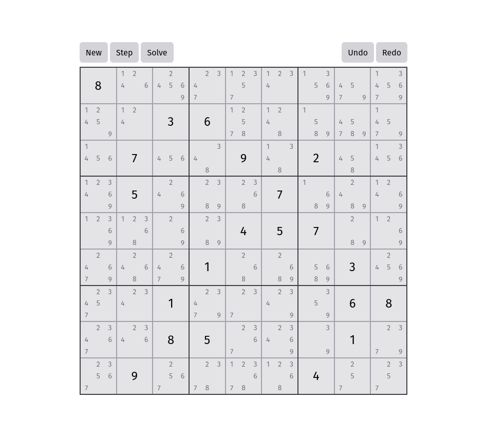

# Sudoku Solver

It's a solver, for sudoku!

### How to use
Click on the numbers to set them. After entering the puzzle press the solve button to completely solve the puzzle or press the step button to step through the solver algorithm. You can hit the undo and redo buttons to go back and forth

### How it works
The algorithm works through simple constraint-solving rules. On a fully empty board every cell is in a superposition of all possible values. When a number is placed in a cell, that superposition "collapses" - that cell can now only contain that number, and cells on the same row, or same column, or same mini grid cannot contain that number. The algorithm repeatedly collapses the cells with the lowest entropies until it reaches a endgame state, at which point it will check for any unfilled cells and start over if needed.
